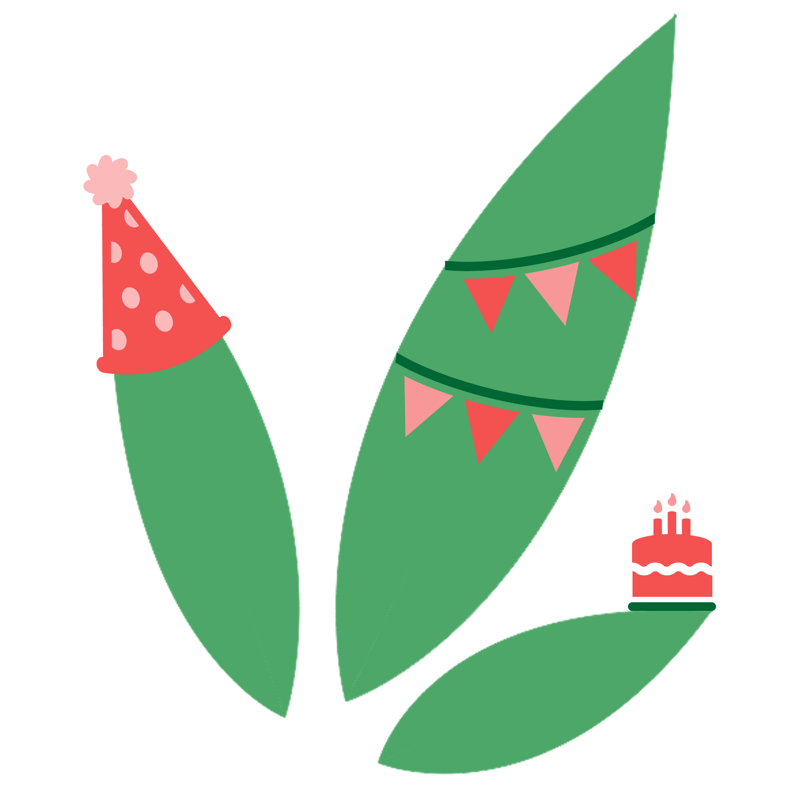

{width=30%}

For me, 2025 felt like one of the most monumental years in my adult life. Last January, I became a freelance medical writer, involving starting up my own company (AloeAloe Medical and Scientific Writing) which, of course, features a plant pun. It was also the year that I moved away from Cardiff (which I fondly refer to as sweet Caerdydd) to a more rural town in South Wales.

As someone with a typically poor memory for past events, this year, I’m hoping to foster a new habit of reflection. At present, I spend a lot of time looking forward – to spring (so I can begin planting this year’s vegetables), to the weekend (so I can engage in the world’s longest lie-in), to dinner… (need I explain?)

With this, I have decided to put finger to key to record my thoughts on the year just gone – largely so that future me can remember(!)

## My reflections on freelance medical writing

First of all, having the opportunity to collaborate with multiple clients, whether familiar or brand new, feels very rewarding. As a freelancer, I am exposed to different ways of working, new therapy areas and innovative projects all at once.

Being the sole employee of a one-person limited company has its upsides, but to me, the main one is that I can rely on no one but myself in the delivery of my work. Obviously, this is also rather scary, but my reason for this is that now I find myself thinking “what if my perspective or experience is useful or new?” instead of “what if I completely misinterpret this task?”

On the flip side, one of the hardest things I’ve encountered in my first year of freelancing is not receiving the same level of feedback as I was used to in&#8209;house. Looking back, moving a project through every stage of the process – receiving feedback from senior writers, editors, clients, compliance reviewers and peers alike – was really valuable to collate fresh perspectives on my work, aiding my understanding of areas for improvement. However, I’ve found the silver lining of this to be that I’ve felt encouraged to find other ways to improve, such as through training, reading and experiencing new project types and therapy areas.

The main thing I miss is having hilarious colleagues and using Teams like it’s the new MSN. That being said, every freelancer I’ve been fortunate enough to virtually meet has been so lovely! A catch-up tea break is only a video call away, after all.

My finding from this first year is that freelancing is one big ebb and one big flow: I’ve decided that I rather like it!

