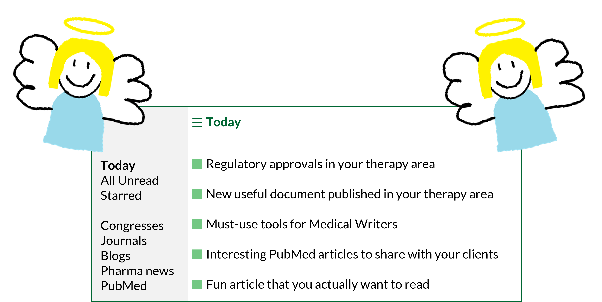

I want to start off this blog post with a disclaimer that I'm about to get really nerdy. 

As in all industries, in MedComms it's very useful to be "up to date". This becomes even more important as a freelancer, as we're typically not as surrounded by people to learn from, bounce ideas off or share knowledge with. We're also not blessed with billable admin time. 

Staying afloat in a vast pool of knowledge can soon become _rather_ overwhelming and time-consuming. There are so many different areas where it would be useful to be kept up to date, from therapy area knowledge to clinical trial updates, to regulatory approvals, to useful tools to improve medical writing… the list is endless. These updates are spread across several corners of the internet, and we don't always have the time or inclination to sift through them. 

Enter the humble RSS feed. **[Angels harmonise in the distance]**

{fig-alt="Two angels, lovingly hand-drawn in Microsoft Paint, delivering a personalised RSS feed"}

## What is an RSS feed?

Imagine a feed where everything you are interested in is collated in one place.1 That can be created with Really Simple Syndication (RSS).1  

Users can create RSS feeds from publicly accessible webpages.1 RSS feed URLs for websites can be tricky to find, however, Justin Pot has published a handy blogpost on Zapier summarising how this can be achieved.2

There are many applications that allow us to read RSS feeds, though many of these require monthly subscriptions. There are free, open-source options available such as WinNewsWire (for Windows) and NetNewsWire (for macOS).

Sitting down to craft an RSS feed does take a bit of upfront time and thought. However, once the initial setup is complete, your RSS feed reader acts like your favourite news app except it delivers information to you from several sources in your ‘Dashboard' or ‘Today' feed (this will differ depending on the RSS feed reader you've chosen – some look flashier than others). 

Each RSS feed you've added to your feed reader can be viewed independently, so you can see the latest results up to a set number of items. You can also add or remove RSS feeds easily, so this doesn't need to be done in one sitting.

## How can I use RSS effectively as a Medical Writer?

Whilst I was writing this post, I created my own RSS feed in WinNewsWire based on the websites I typically source my updates from, so you may find this a handy guide to create your own! 

#### PubMed searches

Newly published articles are added to PubMed every day. While you may be familiar with creating PubMed alerts for your favourite searches,3  you can also create RSS feeds to keep up to date with your favourite topics in one place:4

1.	In PubMed, search for your topic of interest
2.	Make sure your search is refined enough to find everything you're interested in5 – consider the publication date range and any other filters you would like to include
3.	Beneath the search bar, click on the ‘Create RSS' button
4.	From there, create your RSS feed URL for copying into your feed reader

You can add as many searches as you like to your RSS feed and even separate these into different folders if you fancy. 

PubMed searches are probably the best way to stay on top of new insights into therapy areas of interest. Imagine you have a client who is interested in personalised medicine approaches in their specialist therapy area. Before a regular catch-up with them, quickly checking an RSS based on the PubMed search string `"personali*ed medicine" AND "[insert therapy area]"` could be a great way to proactively pass on any insights that have popped up in the literature recently.

#### Congress websites and journals

Another way to keep on top of journal articles and clinical trial data by therapy area is to follow RSS feeds from congress and journal websites. 

For a particular therapy area, consider the main congresses and journals where data and articles are published and investigate whether they have an RSS feed that you can subscribe to in your feed reader. 

For example, if you're interested in updates in oncology, you may wish to follow the European Society for Medical Oncology (ESMO) RSS feed.6 If you often read or use references from _BMJ Oncology_, you may wish to follow some of their RSS feeds.7

#### Pharma news and press releases

Being informed of the latest news in pharma can be incredibly useful. Pharmaceutical companies often host their own news and press-release pages detailing their latest updates on clinical trials, pipeline and regulatory approvals. Adding the RSS feed URLs for these websites to your feed can be handy to understand what these companies are focusing on at the moment.

Alternatively, pharma news websites such as Fierce Pharma,8 Pharmafile,9 and PharmaTimes10 publish press releases and news updates from multiple pharmaceutical companies in their RSS feeds. 

#### Medical writing tips and tricks

In lieu of learning from wonderful colleagues, staying up to date with medical writing blogs via RSS can help supplement learning. For example, in my feed reader, I have included the American Medical Writers Association (AMWA) blog as I find their posts very informative.11 

Whilst I was perusing the interweb to create my own RSS feed, I didn't come across a huge number of resources on general medical writing tips and tricks. One hope I have for the blog that you're currently reading is for it to be a useful source of information for medical writers (whether freelance or not). If you end up dabbling with RSS, feel free to add [my RSS feed URL](/posts.xml) to your feed reader.

## Once I set this up, will I actually use it?

Not to be dramatic, but I've employed my RSS read feeder as my personal research assistant for less than a month and I already feel like it is _life-changing_. 

I'm sure I'm not the only one who dabbles with a bit of admin first thing in the morning to get the cogs whirring. Logging on, checking my RSS feed reader and being greeted with genuinely relevant information from veritable sources is supremely joyous. And in chronological order? With no algorithms in sight? I could weep.

Let me know if you try this out for yourself – I would love to hear your thoughts.

## References

1.	RSS.app. Getting started with RSS feeds. Available at: <https://help.rss.app/en/articles/8742459-getting-started-with-rss-feeds> (accessed July 2026).
2.	Zapier. How to find the RSS feed URL for almost any site. Available at: <https://zapier.com/blog/how-to-find-rss-feed-url/> (accessed July 2026).
3.	NIH. How can I get an alert when a new article of my interest has been added to PubMed? Available at: <https://support.nlm.nih.gov/kbArticle/?pn=KA-03318> (accessed July 2026). 
4.	NIH. Create RSS Feeds in PubMed. Available at: <https://www.nlm.nih.gov/pubs/techbull/ja20/ja20_pubmed_updated.html> (accessed July 2026). 
5.	Research Checker. How to Write a PubMed Search String That Actually Finds Everything. Available at: <https://research-checker.com/blog/how-to-write-a-pubmed-search-string> (accessed July 2026). 
6.	Feeder. ESMO news. Available at: <https://feeder.co/discover/5a82e0a65b/esmo-org> (accessed July 2026). 
7.	BMJ Oncology. RSS feeds. Available at: <https://bmjoncology.bmj.com/pages/rss-feeds> (accessed July 2026). 
8.	Fierce Pharma. RSS Feeds. Available at: <https://www.fiercepharma.com/fiercepharmacom/rss-feeds> (accessed July 2026).
9.	Pharmafile. RSS. Available at: <https://pharmafile.com/rss-2/> (accessed July 2026).
10.	PharmaTimes. RSS – feed subscriptions. Available at: <https://comms.pharmatimes.com/rss-feed-subscriptions/> (accessed July 2026).
11.	AMWA. AMWA blog. Available at: <https://blog.amwa.org/> (accessed July 2026).
