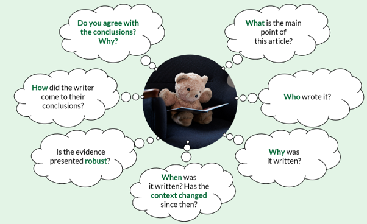
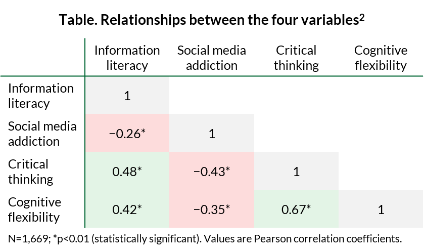

For the first time (maybe ever?), this year, I have fully dedicated myself to the New Year's resolution. As for most people, every New Year begins with me opening a beautiful – albeit seldom-used – notebook and jotting down a list of things about my life I'd like to be different in the upcoming year. The top thing on my list this year was to stop scrolling.

While it had dawned on me that heading to my Instagram or YouTube feed and watching people (or now, horrifyingly, computer-generated "people") carrying out hobbies I had previously done and enjoyed had become _my_ biggest hobby, I hadn't quite grasped to what extent my social media habits had impacted my patterns of thinking.

After being fashionably late to watching _The Social Dilemma_, a cracking if not terrifying documentary, I learned that every time we tap on those tiny squares, we are greeted with a personalised feed that is designed to keep us hooked. For me, that was videos about cooking, sewing, knitting and hero dogs (yes, I do miss those). By keeping the population engaged online, the creators of these platforms have the perfect method to not only generate an enormous advertising income, but also to ultimately influence human behaviour. 

A minor, personal example of this: after a few months of deactivating my Instagram account and pausing my YouTube watch history (life-changing if you're also as painfully addicted as I was), I first noticed that I had suddenly become less consumed by my protein intake and whether I should be buying protein powder to make healthy breakfast oat cake – which, if we're all being honest, really just takes like baked porridge. On a separate note, my partner also remarked that it no longer takes me 20 seconds to respond to a simple question. Oops.

Though whiling away my time in a world of memes all seemed relatively harmless on the surface, the absence of this unassuming hobby has started to make me wonder – had passive scrolling impacted my ability to critically think for myself?

## What is critical thinking?

**Critical thinking is a means of assessing evidence from a variety of sources and drawing a reasoned conclusion that you are capable of explaining to someone else.1**

To engage in critical thinking, The University of Edinburgh recommends purposeful reading to encourage active (as opposed to passive) thinking.1 This could apply to news articles, scientific papers, or really any information that we consume on a daily basis. Essentially, this requires sitting down and answering the following questions:

{fig-alt="A pondering bear considers the following points when reading: What is the main point of this article? Who wrote it? Why was it written? When was it written? Has the context changed since then? Is the evidence presented robust? How did the writer come to their conclusions? Do you agree with the conclusions? Why?"}

## How is critical thinking impacted by chronic social media use?

A study published in _BMC Psychology_ in March 2026 aimed to investigate the relationship between non-clinical social media addiction and the ability to access, evaluate and use information (referred to as 'information literacy') among 1,669 students studying at seven universities in Türkiye.2

#### Social media addiction2

In this study, social media addiction is thought of non-clinically, with multiple definitions:*

* A behavioural addiction that causes cognitive, emotional and social damage when digital platforms are used without control or compulsively
*	An excessive love for social media, an unrelenting need to stay online and uncontrollable motivations that negatively affect important life domains
*	The process of weakening control over executive functions of the individual, and the impulsive system dominating
*	Negatively impacted information-related processing abilities that may manifest as symptoms such as attention problems and reduced cognitive awareness†

#### Information literacy2

Information literacy crucially allows for individuals to decipher through the vast amount of information that is accessible to us, while also providing a layer of protection against manipulation and risks associated with the digital age.

Information literacy is closely related to critical thinking and cognitive flexibility:

* **Critical thinking** allows for individuals to question assumptions and analyse multiple perspectives
* **Cognitive flexibility** strengthens a person's ability to adapt to changing conditions in their environment

#### Data collection and analysis2

This study selected participants based on ease of access (known as convenience sampling) to complete a 'Personal Information Form', whereby individuals scored four variables – social media addiction, information literacy, cognitive flexibility and critical thinking disposition – on relevant scales. The data collected allowed researchers to compare the four different variables and interpret to what extent they impact each other.

This study hypothesised that there would be:

1. A statistically significant relationship between social media addition, information literacy, critical thinking and cognitive flexibility
2. A statistically significant mediating role of critical thinking and cognitive flexibility in the relationship between social media addiction and information literacy

#### Did social media addiction impact critical thinking, cognitive flexibility and information literacy?2

The short answer is _yes_.

To test the study's first hypothesis, Pearson correlation coefficients were calculated to examine the relationships between the four parameters and whether these were statistically significant.

{fig-alt="Matrix of Pearson correlation coefficients showing the relationship between four categories: information literacy, social media addiction, critical thinking, and cognitive flexibility. There is a significant negative correlation between social media addiction and each of the other three categories; those three categories are significantly positively correlated with each other."}

The study found negative and moderate relationships between social media addiction and the ability to critically think, have cognitive flexibility and to demonstrate information literacy (Table, red cells). The authors inferred that **as an individual's social media addiction increases, their information literacy may decrease, meaning they may be more vulnerable to the manipulative qualities of social media content, weakening the ability to critically filter information.**

Meanwhile, there were positive and moderate relationship between critical thinking, cognitive flexibility and information literacy (Table, green cells). 

#### Did critical thinking and cognitive flexibility impact the relationship between social media addiction and information literacy?2

Another short answer – _yes, partially_. 

To test the second hypothesis, a regression-based mediation analysis was performed, whereby:

* Social media addiction was input as the **independent variable** (the parameter that could impact the output)
* Information literacy was input as the **dependent variable** (what was being investigated as the output) 
* Critical thinking and cognitive flexibility were input into the model as **sequential mediators** (variables that could impact how the independent variable ultimately impacts the dependent variable – in this case, social media addiction may impact critical thinking, which may impact cognitive flexibility, both of which may impact information literacy)

In the regression analysis, the study found that social media addiction had a significant (p<0.01) directly negative effect on information literacy (β=−0.48). It also had a significant (p<0.01) negative effect on critical thinking (β=−0.71) and cognitive flexibility (β=−0.17).

When the model was adjusted to include the mediator values, there was a partial mediation effect, in that, while the relationship between social media addiction and information literacy remained significant (p<0.01), the level of negative relationship was weakened (β=−0.09). When specific direct effects were examined, critical thinking was found to be the strongest influence, compared with cognitive flexibility.

**From this, the authors supposed that social media addiction both directly and indirectly affects information literacy, via impacted critical thinking and cognitive flexibility.**

#### How should I interpret these data?2

If you've not read the article yourself, from the above, you may be inferring that social media addiction causes impaired critical thinking and cognitive impairment as well as reduced information literacy. However, this is not the case! In Medical Communications, we are taught to consider the study design and limitations of research articles, which help put them in perspective. 

The study used a cross-sectional approach whereby data were collected and analysed from a single point in time. This means the data indicate an association, rather than an absolute cause-and-effect relationship between the variables. Studies conducted over time, or longitudinally, would be required to establish causal relationships between these variables. Other factors impacting information literacy beyond social media addiction should also be considered, given the moderate strength of the correlation. 

While it's not possible to extrapolate these data to the global population as the study was conducted in one country, and in a relatively small sample of students who participated based on convenience, it certainly provided me some food for thought regarding how social media and my scrolling habits may have been affecting my patterns of thinking. 

## Conclusion

In June 2026, Maia Niguel Hoskin published an interesting article on this topic for Forbes.3 One sentence that stood out to me was: **"[A] problem emerges when commentary becomes a substitute for primary information."**3

Many of us consume our news on social media without reading the source article or publication (if this exists). While a 60-second summary reel may be a snappier way to consume our information, much of the nuance and context is likely to be missing, and we risk "outsourcing critical thinking to people we trust",3 without knowing the agenda of the summariser (that we've inevitably never met).

All that's to say: social media is a crowded place. The platforms that we virtually embrace host millions of opinions, and we engage only with those that either echo ours, or provoke enough emotion to prevent us from closing the app. 

Critical thinking is knowing our sources, assessing their accuracy and drawing our own conclusions.

Do you consider yourself a critical thinker?

---

*Please refer to the fully published article2 to seek the original sources of these definitions.\
†"Claire, would you like a cup of tea?" _[20 seconds later]_ "I'd love to go for a walk!"

## References

1.	The University of Edinburgh. Critical thinking. Available at: <https://institute-academic-development.ed.ac.uk/study-hub/learning-resources/critical> (accessed July 2026).
2.	Toprak E, et al. _BMC Psychol_ 2026;14:584. doi: [10.1186/s40359-026-04337-4](https://doi.org/10.1186/s40359-026-04337-4).
3.	Forbes. Are We Losing The Ability To Think Deeply? What Social Media May Be Doing To Critical Thinking. <https://www.forbes.com/sites/maiahoskin/2026/06/05/are-we-losing-the-ability-to-think-deeply-what-social-media-may-be-doing-to-critical-thinking/> (accessed July 2026). 
